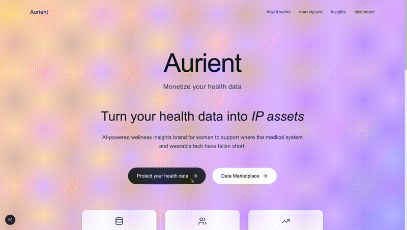
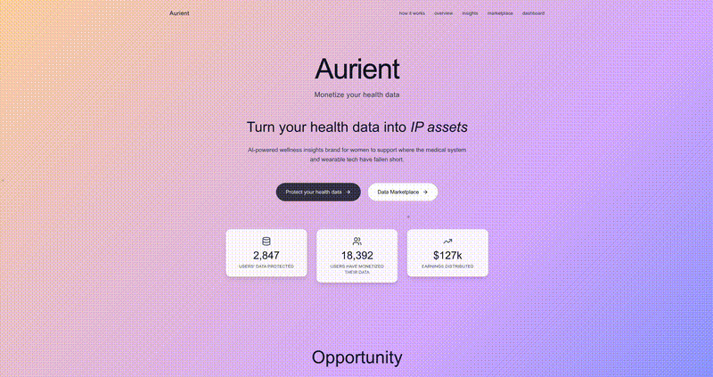
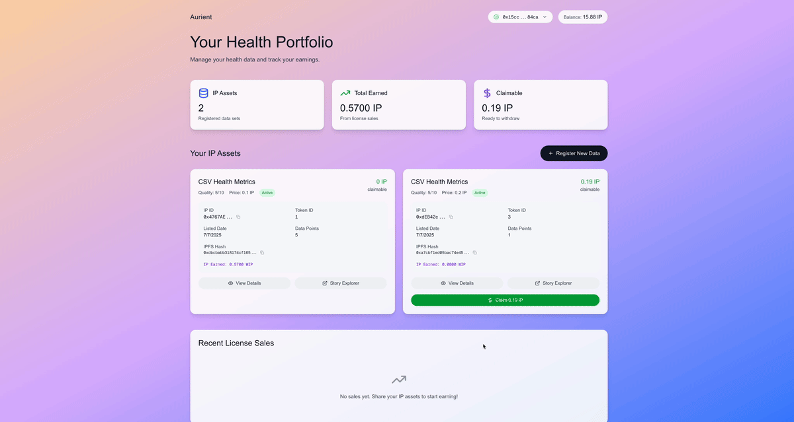

# Aurient - Decentralized Health Data Marketplace

[](https://aurient.vercel.app/)
[](LICENSE)

**Aurient** is a decentralized health data marketplace that transforms health data into monetizable intellectual property assets. Built for the Story Protocol ecosystem, it specifically targets women's health data and positions itself as an AI-powered wellness insights platform that addresses gaps in traditional medical systems and wearable technology.

## 🎯 Project Overview

Aurient enables users to:

- **Upload and Register**: Upload health data files and register them as IP assets on Story Protocol
- **Monetize Data**: Set pricing and earn royalties from data licensing
- **Browse Marketplace**: Discover and purchase health data licenses
- **AI Insights**: Get personalized health recommendations powered by AI
- **Secure Storage**: Store data on IPFS with blockchain ownership verification

## 🏗️ Architecture

This monorepo contains four main components:

```
aurient-monorepo/
├── contracts/          # Smart contracts (Solidity + Foundry)
├── frontend/           # Next.js web application
├── mobile/             # React Native mobile app (Expo)
├── aurient_data/       # Python data analysis toolkit
└── README.md          # This file
```

## 🎥 Demo Videos

### Registration Flow



### Licensing Flow



### Reward Earning Flow



## 🔧 Development

### Using the Makefile (Recommended)

For easier setup and development, use the provided Makefile:

```bash
# Install all dependencies
make install

# Build contracts
make build

# Run all tests (contracts, frontend, data analysis)
make test

# Start the Next.js frontend
enable
make frontend

# Start the Streamlit data dashboard
make dashboard

# Clean build artifacts
make clean

# Generate ABI for HealthDataMarketplace
make abi
```

---

### Manual Setup

### Prerequisites

- **Node.js 18+** and npm/yarn
- **Python 3.8+** and pip
- **Foundry** (for smart contracts)
- **MetaMask** or other Web3 wallet

### 1. Clone and Install Dependencies

```bash
# Clone the repository
git clone https://github.com/your-username/aurient-monorepo.git
cd aurient-monorepo

# Frontend
cd frontend && npm install

# Smart contracts
cd ../contracts && forge install

# Data analysis
cd ../aurient_data && pip install -r requirements.txt
```

### 2. Configure Environment Variables

```bash
# Frontend (.env.local)
NEXT_PUBLIC_STORY_PROTOCOL_ADDRESS=your_story_protocol_address
NEXT_PUBLIC_WIP_TOKEN_ADDRESS=your_wip_token_address

# Contracts (.env)
ETH_FROM=your_deployer_address
STORY_TEST_RPC=your_testnet_rpc_url
```

### 3. Running the Project

#### Frontend (Next.js Application)

```bash
cd frontend
npm run dev
# Open http://localhost:3000
```

#### Smart Contracts (Foundry)

```bash
cd contracts
forge build
forge test
```

#### Data Analysis Toolkit (Python)

```bash
cd aurient_data
python oura_demo.py
# or for dashboard
streamlit run oura_streamlit_app.py
```

#### Mobile App (React Native + Expo)

```bash
cd mobile
npm install
npm start
# Run on iOS: npm run ios
# Run on Android: npm run android
# Run on Web: npm run web
```

### 4. Deployment

#### Frontend (Vercel)

```bash
cd frontend
npm run build
# Deploy to Vercel via GitHub integration
```

#### Smart Contracts

```bash
cd contracts
forge script script/Deploy.s.sol:DeployHealthDataMarketplace \
    --rpc-url $STORY_MAINNET_RPC --broadcast --verify
```

---

## 📱 Live Application

**🌐 Live Site:** [https://aurient.vercel.app/](https://aurient.vercel.app/)

The live application includes:

- **Landing Page**: Platform overview and features
- **Registration Flow**: Upload health data and register as IP
- **Dashboard**: Manage assets and track earnings
- **Marketplace**: Browse and purchase health data licenses
- **Insights**: AI-powered health recommendations

---
